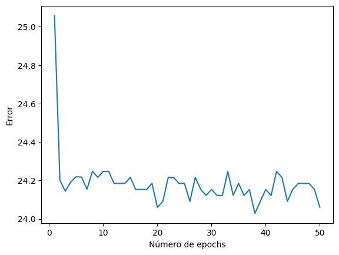

# AST (Audio Spectrogram Transformer) para identificación de samples
* Britny Brito Juárez 421074668
* David Salvador Preciado Márquez 421091670

Clasificador que identifica samples en canciones.

## Implementación
Para la implementación del proyecto nos basamos en la arquitectura conocida como Audio Spectrogram Transformer, desarrollada por Gong et al en 2021.

Algunos detalles que vale la pena resaltar son los siguiente:
* Se procesan los audios como si fueran imágenes obteniendo el espectrograma del audio (de ahí el nombre de la arquitectura). Para hacer lo anterior se cuenta con la clase dataloader en la cual se discretizan las frecuencias en secuencias de bins.
* Se dividen los espectrogramas en secuencias de patches, obtenemos embeddings de estos patches mediante una capa de proyección lineal.
* Esta arquitectura cuenta con un embedding posicional entrenado, y solo usa el codificador del transformador.
* Como nos basamos en la arquitectura de procesamiento de imágenes, tenemos un modelo multi cabeza. Con el objetivo de tener un mejor rendimiento se usa un token (`class_token`) para guardar la información de todos los patches.
* Con  el objetivo de tener un mejor desempeño, se optó por usar las implementaciones de Hugging Face de algunos componentes del transformador que sirven para procesamiento de imágenes. Dichas componentes se encuentran en las siguientes clases
    * Attention
    * LayerScale
    * DropPath
    * Mlp
    * Block
* A diferencia de la arquitectura presentada en el artículo, nosotros agregamos una capa adicional que aplica la función softmax sobre las salidas.
* Nuestro dataset se encuentra conformado por archivos flac en mono, con un muestreo de 16 kHz. Los archivos de audio fueron obtenidos a mano, el csv que relaciona cada canción con su sample que proviene de un dataset encontrado en Kaggle. Consta en su mayoría de canciones de hip-hop.
* Si bien es posible que se tenga más de un sample por canción, el clasificador solo identificará uno de esos samples.
* Evaluamos con el mismo conjunto que usamos para entrenar. Esto es porque el modelo solo puede identificar samples que ha "escuchado", y por lo tanto no tendría sentido esperar que identifique correctamente uno que no estuvo en su conjunto de entrenamiento.
* El archivo de pesos modelo_audio.pth fue conseguido entrenando en una GPU Nvidia Tesla T4 durante 50 ciclos. El entrenamiento tardó 30 min, y generó la gráfica de error mostrada a continuación:
      
    
## Resultados
Con el entrenamiento anteriormente mencionado se logró una precisión de 43%. El resultado bajo es esperado, ya que el conjunto de datos es relativamente pequeño. Sin embargo, este modelo presenta la oportunidad de reutilizar los pesos como preentreno de un modelo más grande, para entrenar con un dataset mucho mayor.

## Dependencias
Para el correcto funcionamiento del proyecto es necesario tener instalado:
* torch
* torchaudio
* timm
* wget

### Fuentes
* Gong, Y., Chung, Y., & Glass, J. (2021). AST: Audio Spectrogram Transformer. arXiv (Cornell University). https://doi.org/10.48550/arxiv.2104.01778
* Huggingface. (s. f.). GitHub - huggingface/pytorch-image-models: PyTorch image models, scripts, pretrained weights -- ResNet, ResNeXT, EfficientNet, EfficientNetV2, NFNet, Vision Transformer, MixNet, MobileNet-V3/V2, RegNet, DPN, CSPNet, and more. GitHub. https://github.com/huggingface/pytorch-image-models
* Hip-Hop Sample ID Dataset. (2020, 21 junio). Kaggle. https://www.kaggle.com/datasets/victorcvriano/hiphop-sample-id-dataset